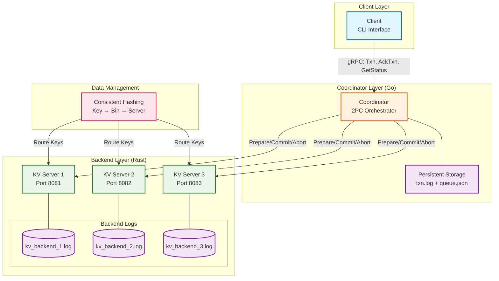
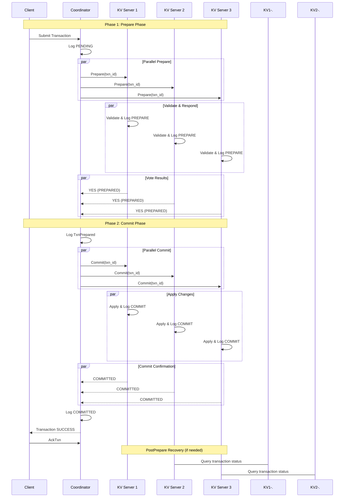

# Distributed Transaction Processing System

A fault-tolerant distributed transaction processing system implementing the Two-Phase Commit (2PC) protocol. This system ensures ACID properties across multiple distributed key-value stores with comprehensive crash recovery and fault tolerance mechanisms.

## System Architecture

## Transaction Workflow

## Features
- Fault Tolerance: Handles coordinator and backend crashes at any protocol phase
- Persistent Logging: Durable transaction logs for crash recovery
- PostPrepare Protocol: Termination protocol for uncertain transaction resolution
- Idempotent Operations: Safe handling of duplicate messages and retries
- Comprehensive Testing: Automated test suite covering 13 failure scenarios
- Data Partitioning: Consistent hashing for scalable data distribution
- ACID Guarantees: Full transactional semantics across distributed stores
