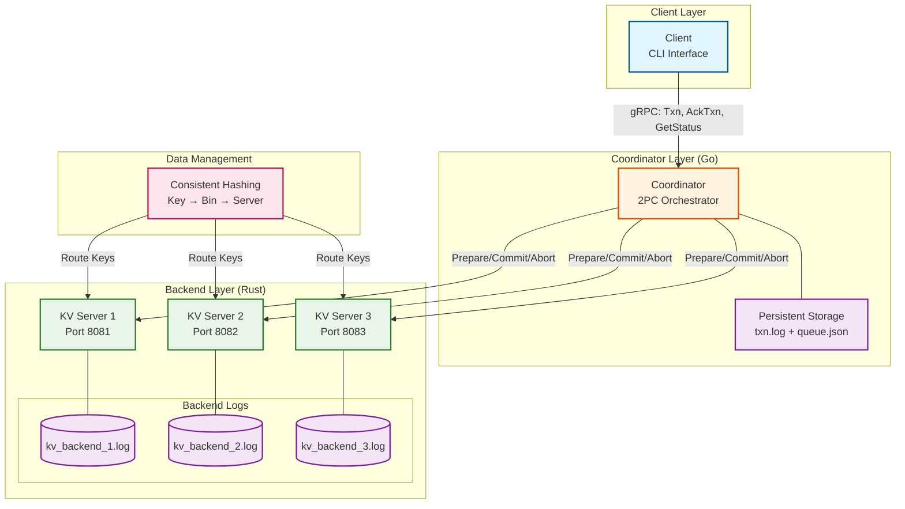
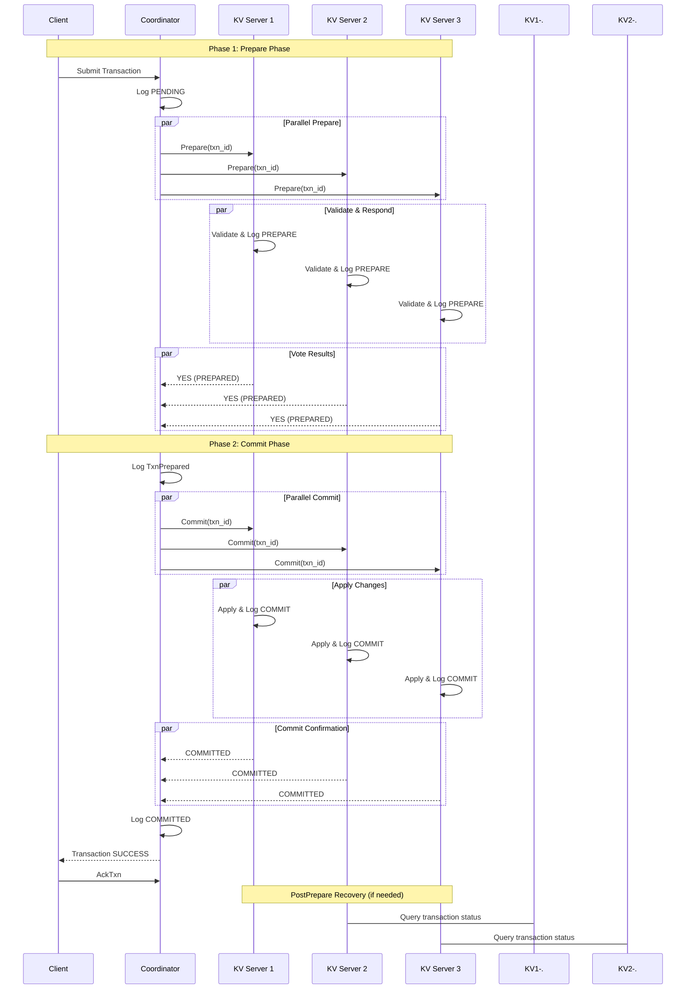

# Distributed Transaction Processing System

A fault-tolerant distributed transaction processing system implementing the Two-Phase Commit (2PC) protocol. This system ensures ACID properties across multiple distributed key-value stores with comprehensive crash recovery and fault tolerance mechanisms.

## System Architecture

## Transaction Workflow

## Key Features

- **Fault Tolerance**: Handles coordinator and backend crashes at any protocol phase
- **Persistent Logging**: Durable transaction logs for crash recovery
- **PostPrepare Protocol**: Termination protocol for uncertain transaction resolution
- **Idempotent Operations**: Safe handling of duplicate messages and retries
- **Comprehensive Testing**: Automated test suite covering 13 failure scenarios
- **Data Partitioning**: Consistent hashing for scalable data distribution
- **ACID Guarantees**: Full transactional semantics across distributed stores

## Test Suite

The system includes extensive testing covering various failure scenarios to ensure fault tolerance and correctness across all phases of the 2PC protocol.

#### Coordinator Crash Tests (C1-C7)

**Test Scenarios:**
- **C1 - Normal Transaction Execution**: Baseline correctness under failure-free conditions
- **C2 - Crash after Sending Prepare**: Coordinator crashes after sending Prepare messages but before receiving responses
- **C3 - Crash after Prepare ACKs Received**: Coordinator crashes after receiving all Prepared acknowledgments but before sending Commit
- **C4 - Crash after TxnPrepared Log Written**: Coordinator crashes after logging TxnPrepared state but before sending Commit messages
- **C5 - Crash after Some Commit Sent**: Coordinator crashes after partially completing the commit phase
- **C6 - Crash after Full Commit but Before Client ACK**: Coordinator crashes after all participants commit but before client notification
- **C7 - Normal Commit with Delayed Client ACK**: System tolerance for delayed client acknowledgments

#### Backend Crash Tests (S1-S6)

**Test Scenarios:**
- **S1 - Backend Crash Before Prepare**: Backend crashes before receiving any Prepare message
- **S2 - Crash after Prepare Written but Before ACK Sent**: Backend crashes after persisting PREPARE log but before sending acknowledgment
- **S3 - Crash after Prepare ACK, Before Commit**: Backend crashes after acknowledging Prepare but before receiving Commit
- **S4 - Crash after Partial Commit Applied**: Backend crashes mid-way through applying the Commit phase
- **S5 - Crash after Commit Fully Done**: Backend crashes after successfully completing the commit operation
- **S6 - Crash after Abort Written**: Backend crashes after logging ABORT but before completing cleanup

#### Extended Failure Scenarios

**Network Partition Tests:**
- **N1 - Partition During Prepare**: Coordinator partitioned from subset of servers during prepare phase
- **N2 - Partition During Commit**: Network partitions occurring after prepare but before commit
- **N3 - Partition Between Backends**: Backend servers unable to communicate during PostPrepare resolution

**Client Fault Tolerance:**
- **CL1 - Client Crash Before ACK**: Client crashes after submitting transaction but before acknowledgment
- **CL2 - Client Crash After Seeing Commit**: Client crashes after receiving COMMITTED response
- **CL3 - Restarted Client GetStatus Flow**: Client restart and transaction status recovery

**Timing and Race Conditions:**
- **T1 - Late Prepare ACK**: Late-arriving Prepare responses after coordinator timeout
- **T2 - Late Commit ACK After Coordinator Crash**: Delayed commit acknowledgments after coordinator restart
- **T3 - DISCARD Despite Commit Observed**: Conflicting PostPrepare outcomes between backends

## Future Work
- **Concurrent Transaction Support**: Key-level conflict detection
- **Dynamic Node Management**: Automatic backend discovery
- **Performance Optimizations**: Batching and pipelining
- **Enhanced Monitoring**: Metrics and health checks
- **Byzantine Fault Tolerance**: Advanced failure handling
